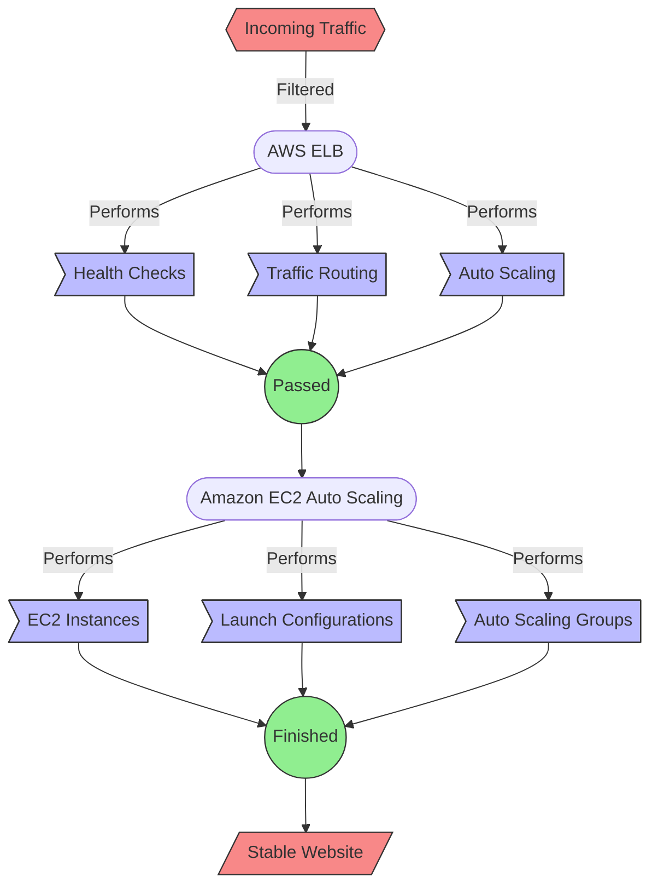

```mermaid
graph TD
    loadbalancing(["AWS ELB"])
    
    elbcheck1>"Health Checks"]
    elbcheck2>"Traffic Routing"]
    elbcheck3>"Auto Scaling"]

    redundantserver(["Amazon EC2 Auto Scaling"])

    ec2method1>"EC2 Instances"]
    ec2method2>"Launch Configurations"]
    ec2method3>"Auto Scaling Groups"]

    connector1(("Passed"))
    connector2(("Finished"))
    
    A{{"Incoming Traffic"}} --> |Filtered| loadbalancing
    
    loadbalancing --> |Performs| elbcheck1
    loadbalancing --> |Performs| elbcheck2
    loadbalancing --> |Performs| elbcheck3

    elbcheck1 --> connector1
    elbcheck2 --> connector1
    elbcheck3 --> connector1
    
    connector1 --> redundantserver

    redundantserver --> |Performs| ec2method1
    redundantserver --> |Performs| ec2method2
    redundantserver --> |Performs| ec2method3

    ec2method1 --> connector2
    ec2method2 --> connector2
    ec2method3 --> connector2

    connector2 --> B[/"Stable Website"/]

    style A fill:#f88888,stroke:#333333,stroke-width:0.075rem
    style B fill:#f88888,stroke:#333333,stroke-width:0.075rem
    
    style elbcheck1 fill:#bbf,stroke:#333333,stroke-width:0.075rem
    style elbcheck2 fill:#bbf,stroke:#333333,stroke-width:0.075rem
    style elbcheck3 fill:#bbf,stroke:#333333,stroke-width:0.075rem

    style ec2method1 fill:#bbf,stroke:#333333,stroke-width:0.075rem
    style ec2method2 fill:#bbf,stroke:#333333,stroke-width:0.075rem
    style ec2method3 fill:#bbf,stroke:#333333,stroke-width:0.075rem

    style connector1 fill:#90ee90,stroke:#333333,stroke-width:0.075rem
    style connector2 fill:#90ee90,stroke:#333333,stroke-width:0.075rem
```
