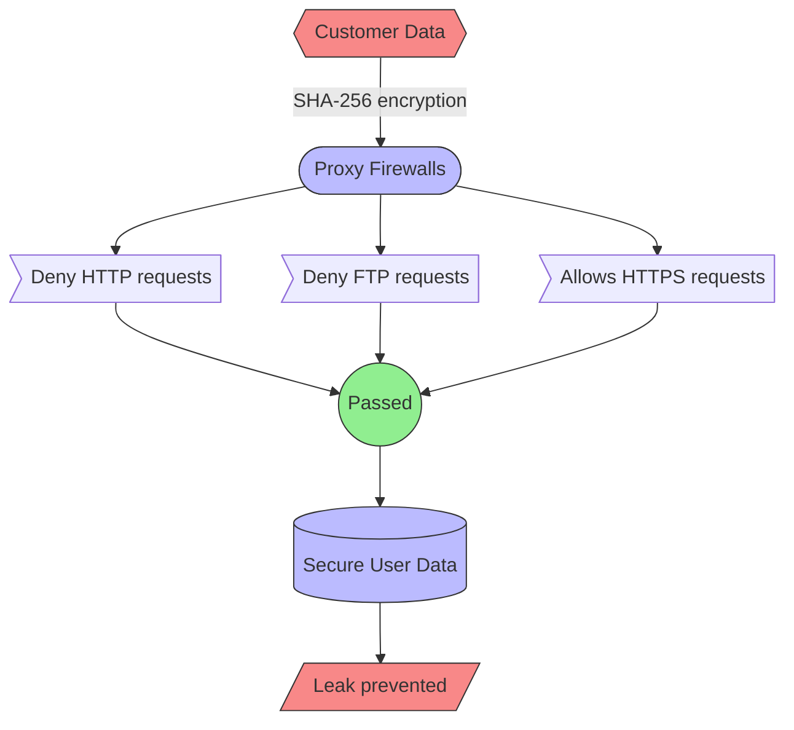

```mermaid
graph TD
    firewall(["Proxy Firewalls"])
    database[("Secure User Data")]
    
    firewallmethod1>"Deny HTTP requests"]
    firewallmethod2>"Deny FTP requests"]
    firewallmethod3>"Allows HTTPS requests"]

    connector1(("Passed"))
    
    A{{Customer Data}} -->|SHA-256 encryption| firewall
    
    firewall --> firewallmethod1
    firewall --> firewallmethod2
    firewall --> firewallmethod3

    firewallmethod1 --> connector1
    firewallmethod2 --> connector1
    firewallmethod3 --> connector1

    connector1 --> database
    database --> B[/"Leak prevented"/]

    style A fill:#f88888,stroke:#333333,stroke-width:.0.075rem
    style B fill:#f88888,stroke:#333333,stroke-width:.0.075rem

    style firewall fill:#bbf,stroke:#333333,stroke-width:.0.075rem
    style database fill:#bbf,stroke:#333333,stroke-width:.0.075rem

    style connector1 fill:#90ee90,stroke:#333333,stroke-width:.0.075rem
```
