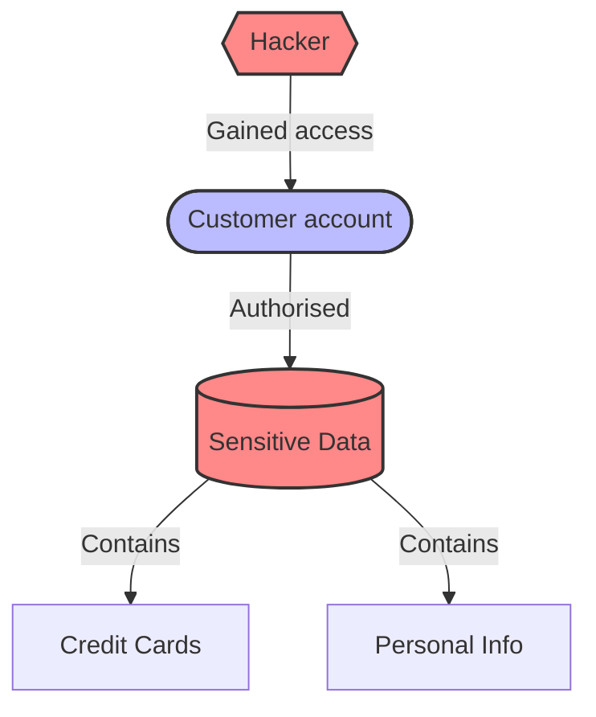

```mermaid
graph TD
    A{{"Hacker"}} --> |Gained access| B(["Customer account"])
    B --> |Authorised| C[("Sensitive Data")]
    C --> |Contains| D["Credit Cards"]
    C --> |Contains| E["Personal Info"]
    
    style A fill:#f88,stroke:#333,stroke-width:2px
    style B fill:#bbf,stroke:#333,stroke-width:2px
    style C fill:#f88,stroke:#333,stroke-width:2px
```
